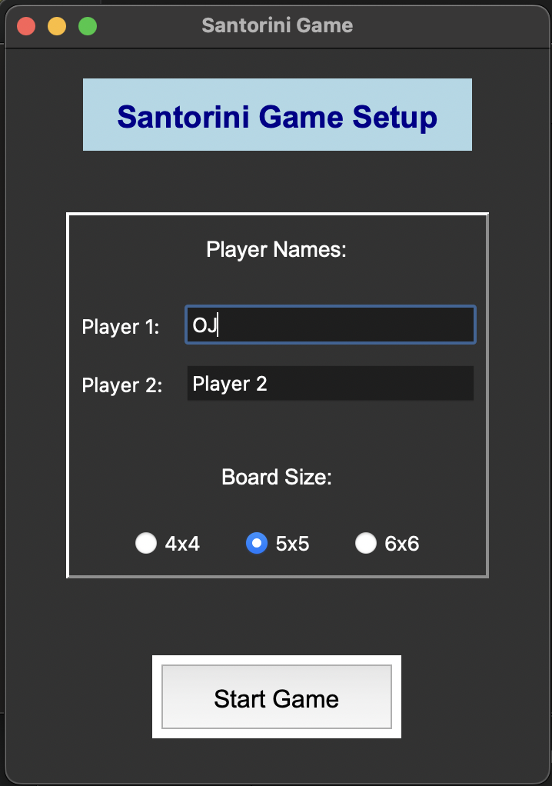
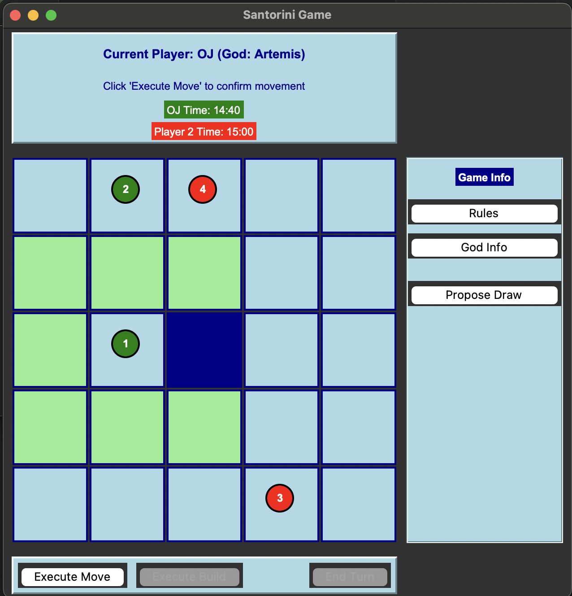
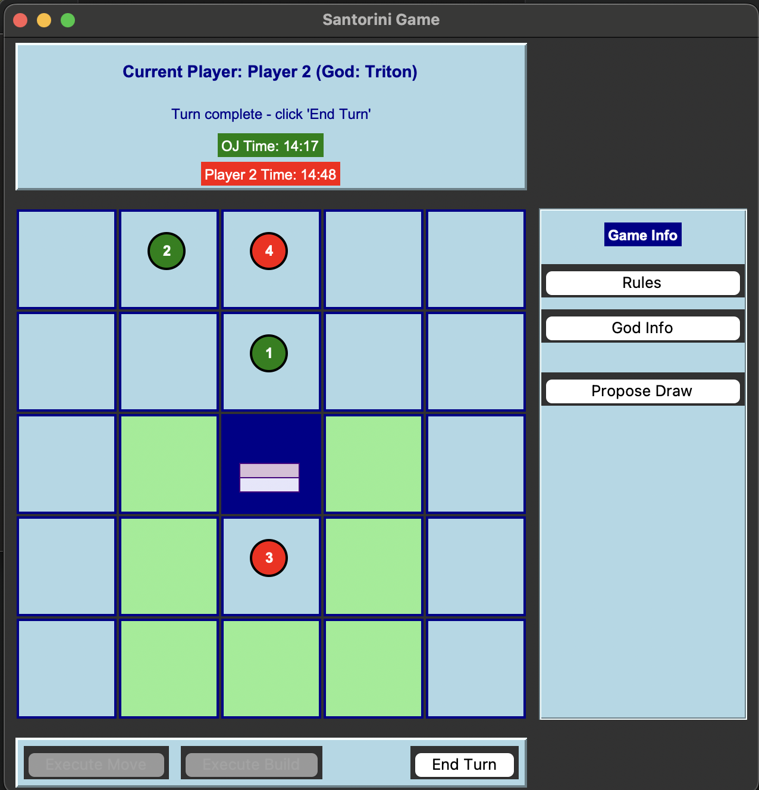

## How to run this?
The following executable has been created for MacOS Sequioa and Python 3.13.3

Ensure that python has been installed. Create a virtual environment and install the requirements using the following commands

```
python3 -m venv venv
source venv/bin/activate
pip3 install -r requirements.txt
```
* You can make an executable with the following command <br />
Generate the exe from main.py using ``pyinstaller main.py --onefile --name santorini --windowed``

Or you can navigate to the dist folder and click on the santorini.app

You can also run the app by doing ``python3 main.py`` from the root folder.


